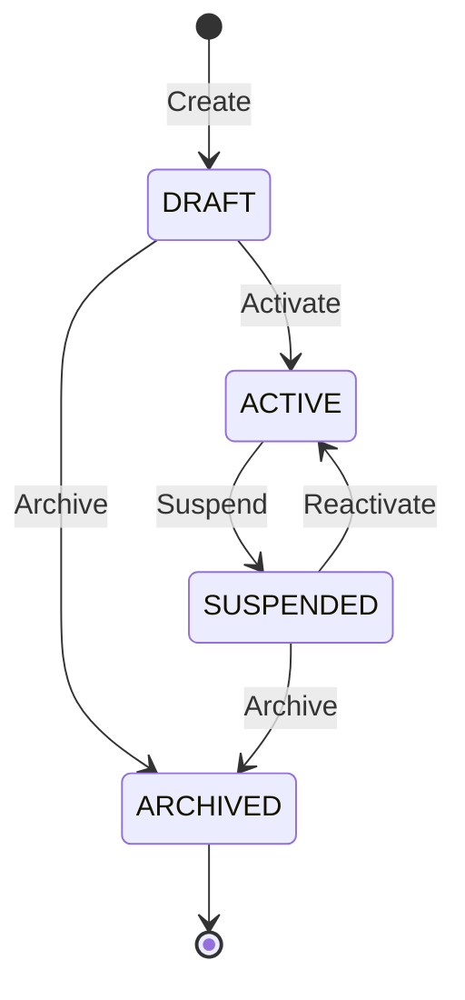

# Accounting Books Capability

## 1. Purpose

An Accounting Book is the top-level accounting boundary for a business owner. It establishes the accounting environment under which fiscal years, accounts, journal entries, balances, and financial reports are organized.

This document defines the business meaning, scope, invariants, lifecycle, and use cases of Accounting Books. Implementation rules are defined separately in `docs/architecture-guide.md`.

## 2. Scope

The Accounting Books capability owns:

- The identity of an Accounting Book.
- Its human-readable code and title.
- Its association with a business owner.
- Its lifecycle and operational status.
- The business rules governing creation, activation, suspension, and archival.
- Discovery and listing of Accounting Books.

## 3. Non-Scope

The capability does not own:

- The identity or profile of the business owner.
- Fiscal years.
- Chart of accounts.
- Journal entries or accounting documents.
- Account balances.
- Financial statements and reports.
- User identity or authentication.
- Permission definitions.
- Shard administration.

These concerns belong to other capabilities or modules.

## 4. Business Terminology

### Accounting Book

A durable accounting boundary belonging to exactly one business owner.

### Owner

The business subject for which the Accounting Book exists. An owner is identified by an owner type and owner ID.

The owner is managed outside this capability. Accounting Books retains only the owner's identity.

### Code

A short, stable, human-readable identifier for an Accounting Book. Codes are compared using their normalized uppercase form.

### Title

The human-readable display name of an Accounting Book.

### Draft

The Accounting Book exists but is not yet operational.

### Active

The Accounting Book is operational and may be used by accounting processes that require an active book.

### Suspended

The Accounting Book is temporarily unavailable for accounting processes that require an active book. Suspension is reversible.

### Archived

The Accounting Book has been permanently retired. Archival is irreversible.

## 5. Business Information

An Accounting Book records:

| Information | Business meaning |
| --- | --- |
| ID | Permanent system identity of the Accounting Book |
| Code | Stable business-facing identifier |
| Title | Display name |
| Owner type | Category of the owning business subject |
| Owner ID | Identity of the owning business subject |
| Status | Current lifecycle state |
| Created at | Time at which the book was created |
| Updated at | Time of its most recent change |
| Activated at | Time of its most recent activation |
| Suspended at | Time of its most recent suspension |
| Archived at | Time at which it was permanently archived |

## 6. Business Invariants

The following rules must always hold:

1. Every Accounting Book has a permanent identity.
2. Every Accounting Book has a non-empty code and title.
3. Every Accounting Book belongs to exactly one owner.
4. An owner may have at most one Accounting Book.
5. An Accounting Book code is unique across Accounting Books.
6. Codes are trimmed and normalized to uppercase.
7. Owner types are trimmed and normalized to uppercase.
8. Owner IDs are trimmed.
9. A new Accounting Book always begins in `DRAFT` status.
10. An Accounting Book changes status only through a valid lifecycle transition.
11. An archived Accounting Book never returns to another state.
12. Archival does not delete the Accounting Book or erase its history.
13. Creation and lifecycle times are assigned by the system, not supplied by clients.

## 7. Lifecycle

### Allowed transitions

| Current status | Operation | Resulting status |
| --- | --- | --- |
| `DRAFT` | Activate | `ACTIVE` |
| `DRAFT` | Archive | `ARCHIVED` |
| `ACTIVE` | Suspend | `SUSPENDED` |
| `SUSPENDED` | Activate | `ACTIVE` |
| `SUSPENDED` | Archive | `ARCHIVED` |

All other transitions are invalid.

### Lifecycle rules

- An active Accounting Book must be suspended before it can be archived.
- Activating an already active or archived book is invalid.
- Suspending a draft, suspended, or archived book is invalid.
- Archiving an active or already archived book is invalid.
- Repeating an invalid transition produces a business failure; it is not treated as a successful no-op.
- Each successful lifecycle transition records when it occurred.

## 8. Use Cases

### 8.1 Create Accounting Book

#### Business intent

Establish a new Accounting Book for a business owner.

#### Required information

- Code.
- Title.
- Owner type.
- Owner ID.

#### Business outcome

- A new Accounting Book is created.
- Its code and owner identity are normalized.
- It receives a permanent system identity.
- Its initial status is `DRAFT`.

#### Business failures

- Required information is invalid or missing.
- The normalized code is already assigned to another Accounting Book.
- The owner already has an Accounting Book.

### 8.2 Get Accounting Book

#### Business intent

View one Accounting Book by its permanent identity.

#### Business outcome

The authorized caller receives the book's identity, descriptive information, owner identity, lifecycle status, and relevant timestamps.

#### Business failures

- The Accounting Book does not exist.
- The caller is not permitted to view it.

### 8.3 List Accounting Books

#### Business intent

Discover Accounting Books visible to the caller.

#### Supported criteria

- Lifecycle status.
- Owner type.
- Owner identity, where permitted.
- Search by code or title.
- Page and page size.

#### Business outcome

The caller receives an authorized, consistently ordered, paginated list of Accounting Books and the corresponding total count.

The caller may narrow the authorized result set but may not expand it by supplying owner criteria.

### 8.4 Activate Accounting Book

#### Business intent

Make a draft or suspended Accounting Book operational.

#### Business outcome

- The status becomes `ACTIVE`.
- The activation time is recorded.

#### Business failures

- The Accounting Book does not exist.
- The caller is not permitted to manage it.
- Its current status does not allow activation.

### 8.5 Suspend Accounting Book

#### Business intent

Temporarily prevent an active Accounting Book from being used by processes that require an active book.

#### Business outcome

- The status becomes `SUSPENDED`.
- The suspension time is recorded.

#### Business failures

- The Accounting Book does not exist.
- The caller is not permitted to manage it.
- The book is not active.

### 8.6 Archive Accounting Book

#### Business intent

Permanently retire an Accounting Book while preserving its identity and history.

#### Business outcome

- The status becomes `ARCHIVED`.
- The archival time is recorded.
- The book remains available for historical reference subject to authorization.

#### Business failures

- The Accounting Book does not exist.
- The caller is not permitted to manage it.
- The book is active.
- The book is already archived.

## 9. Authorization Rules

- Only authenticated users may access Accounting Books.
- Reading, creating, and managing lifecycle may require different permissions.
- A user with general access to the Accounting module is not automatically permitted to perform every Accounting Book operation.
- Access may be restricted by the owner represented by the Accounting Book.
- A caller may view or change only books within their authorized business scope.
- Listing must never reveal Accounting Books outside the caller's authorized scope.
- Unauthorized callers must not receive protected Accounting Book details.

Exact permission names and the mechanism that relates users to owners are defined by the application-wide authorization model.

## 10. Data Placement

Accounting Book metadata belongs in the General Database.

Accounting Books must be discoverable before accessing accounting data that may be partitioned elsewhere. An Accounting Book may act as a business partition reference for other Accounting capabilities, but its identity does not itself determine a physical shard.

## 11. Relationships with Other Capabilities

Other Accounting capabilities may associate their records with an Accounting Book by its identity.

Expected relationships include:

- Fiscal years belong to an Accounting Book.
- Account structures are defined within an Accounting Book.
- Journal entries are recorded within an Accounting Book and fiscal year.
- Balances and reports are interpreted within an Accounting Book.

These relationships do not transfer ownership of Accounting Book lifecycle to the dependent capabilities.

Dependent capabilities must define what book statuses they accept. They must not assume that the existence of a book means it is operational.

## 12. Relationships with Other Modules

Other modules may need to:

- Confirm that an Accounting Book exists.
- Confirm that it is operational.
- Obtain its stable identity or owner association.
- React to lifecycle changes.

Such interactions must use public Accounting module contracts or published business events. The Accounting module remains authoritative for Accounting Book state.

No public cross-module contract or event is mandated until a concrete business workflow requires it.

## 13. Stable Business Failures

| Error code | Business meaning |
| --- | --- |
| `accounting_book_not_found` | The requested Accounting Book does not exist or is not visible under the applicable contract |
| `accounting_book_code_already_exists` | The normalized code is already assigned |
| `accounting_book_owner_already_exists` | The owner already has an Accounting Book |
| `accounting_book_cannot_be_activated` | Activation is invalid in the current state |
| `accounting_book_cannot_be_suspended` | Suspension is invalid in the current state |
| `accounting_book_cannot_be_archived` | Archival is invalid in the current state |

These codes form part of the capability's observable contract and must remain stable unless an explicit compatibility decision changes them.

## 14. Open Business Decisions

The following questions are not yet settled:

1. What owner types are permitted, and which capability or module defines them?
2. Must the owner be verified before creating an Accounting Book?
3. May an Accounting Book code ever be changed?
4. May the title be changed, and in which lifecycle states?
5. Does archiving require all dependent fiscal years or accounting processes to be closed first?
6. Which lifecycle changes must publish business events?
7. Should historical lifecycle changes be kept as a separate audit history beyond the current timestamps?

Coding agents must not invent answers to these questions. A task that depends on one of them requires an explicit business decision and an update to this document.
