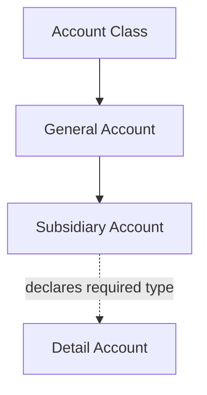
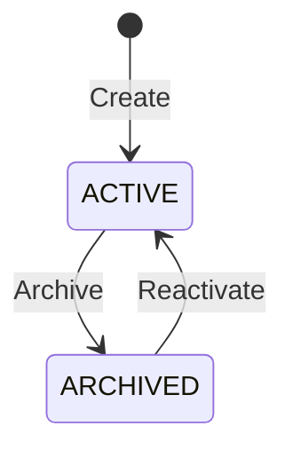

# Chart of Accounts Capability

## 1. Purpose

The Chart of Accounts defines the accounting structure used to classify every ledger posting in Apex. It provides a shared hierarchy of account classes, general accounts, and subsidiary accounts, together with their accounting nature and detail-account requirements.

The Chart of Accounts is global and shared by all Accounting Books. An Accounting Book uses the shared chart but does not own or customize it.

This document defines the business meaning, scope, invariants, lifecycle, and use cases of the Chart of Accounts. Implementation rules are defined separately in `docs/architecture_guide.md`.

## 2. Capability Name

`Chart of Accounts` is the name of the business capability. It does not imply the existence of a `ChartOfAccounts` entity.

The capability is represented by its account hierarchy:

```text
Account Class
└── General Account
    └── Subsidiary Account
```

A separate root entity is unnecessary while Apex has exactly one global shared chart.

## 3. Scope

The Chart of Accounts capability owns:

- Account Classes.
- General Accounts.
- Subsidiary Accounts.
- The hierarchy between these account levels.
- Account codes and names.
- Account nature.
- Detail-account requirements declared by Subsidiary Accounts.
- Account activation and archival.
- Discovery, listing, tree display, and account selection.
- Rules determining whether an account may receive new ledger postings.

## 4. Non-Scope

The capability does not own:

- Accounting Books.
- Fiscal Years.
- Detail-account instances such as a particular bank account, symbol, or person.
- Accounting documents or ledger lines.
- Account balances.
- Trial balances or financial statements.
- Opening and closing balances.
- Book-specific customization of the shared chart.
- Physical shard assignment or storage administration.

These concerns belong to other Accounting capabilities or other modules.

## 5. Business Terminology

### Chart of Accounts

The complete shared hierarchy of valid accounting classifications available to Accounting Books.

### Account Class

The highest classification level in the chart. It groups General Accounts by broad accounting meaning.

Examples may include assets, liabilities, equity, income, and expenses. The definitive set is business-controlled and is not prescribed by this document.

### General Account

An account under one Account Class. It represents the general or heading level of classification, traditionally called `کل`.

### Subsidiary Account

A posting-level account under one General Account, traditionally called `معین`.

A Subsidiary Account determines whether a ledger posting requires a Detail Account and which type is permitted.

### Detail Account

An auxiliary accounting dimension referenced by a ledger line, such as a specific bank account, symbol, or person. Detail Accounts are managed by a separate capability.

Detail Accounts are not structural nodes in the Chart of Accounts.

### Account Nature

The expected accounting balance orientation of an account:

- `DEBTOR`
- `CREDITOR`
- `NEUTRAL`

Nature supports validation, balance interpretation, and reporting. It does not replace debit and credit on ledger lines.

### Detail-Account Type

The kind of Detail Account that a Subsidiary Account requires. Every Subsidiary Account requires
one of these types; a Subsidiary Account that accepts no Detail Account is not supported.

- `BANK`
- `SYMBOL`
- `PERSON`

The set may be extended later through an explicit business decision.

### Active

The account is available for its permitted business use and, at the Subsidiary level, may receive new ledger postings.

### Archived

The account is retained for history and reporting but is unavailable for new ledger postings.

## 6. Business Information

### Account Class

| Information | Business meaning |
| --- | --- |
| ID | Permanent system identity |
| Code | Stable class identifier |
| Name | Human-readable class name |
| Status | Current lifecycle state |
| Created at | Time at which the class was created |
| Updated at | Time of its most recent change |
| Archived at | Time at which it was archived |

### General Account

| Information | Business meaning |
| --- | --- |
| ID | Permanent system identity |
| Account Class ID | Parent Account Class |
| Code | Stable identifier within its Account Class |
| Name | Human-readable account name |
| Nature | Debtor, creditor, or neutral orientation |
| Status | Current lifecycle state |
| Created at | Time at which the account was created |
| Updated at | Time of its most recent change |
| Archived at | Time at which it was archived |

### Subsidiary Account

| Information | Business meaning |
| --- | --- |
| ID | Permanent system identity |
| General Account ID | Parent General Account |
| Code | Stable identifier within its General Account |
| Name | Human-readable account name |
| Nature | Debtor, creditor, or neutral orientation |
| Detail-account type | Required type of Detail Account |
| Status | Current lifecycle state |
| Created at | Time at which the account was created |
| Updated at | Time of its most recent change |
| Archived at | Time at which it was archived |

## 7. Business Invariants

The following rules must always hold:

1. The Chart of Accounts is global and shared by every Accounting Book.
2. An Account Class has a permanent identity, non-empty code, and non-empty name.
3. A General Account belongs to exactly one Account Class.
4. A Subsidiary Account belongs to exactly one General Account.
5. Every account code is trimmed and normalized consistently.
6. Account Class codes are globally unique.
7. A General Account code is unique within its Account Class.
8. A Subsidiary Account code is unique within its General Account.
9. A General Account cannot exist without its Account Class.
10. A Subsidiary Account cannot exist without its General Account.
11. Only Subsidiary Accounts may receive ledger postings.
12. A Subsidiary Account declares exactly one Detail-Account Type.
13. Ledger lines using the Subsidiary Account must reference a Detail Account of that exact type.
14. A ledger line without a Detail Account is never valid; a Detail Account code is required on every line.
15. An archived Subsidiary Account cannot receive new ledger postings.
16. Historical ledger lines remain associated with archived accounts.
17. Archival never deletes or rewrites accounting history.
18. Account nature must be one of `DEBTOR`, `CREDITOR`, or `NEUTRAL`.
19. Account codes are immutable from creation. Usage by accounting data is not tracked yet, so mutation is prohibited conservatively for every account.
20. Parent relationships and account nature are immutable from creation.
21. A Subsidiary Account's Detail-Account Type is immutable from creation.
22. Physical deletion is not supported. Archival is the only retirement operation.
23. System-assigned identities and timestamps are not supplied by clients.

## 8. Hierarchy Rules



- An Account Class may contain multiple General Accounts.
- A General Account may contain multiple Subsidiary Accounts.
- A Subsidiary Account has no structural children in this capability.
- Detail Accounts are referenced during posting and are not children owned by the chart.
- Ledger postings must identify one valid Subsidiary Account.
- The complete account path is derived from the Subsidiary Account and its ancestors.

## 9. Lifecycle

Account Classes, General Accounts, and Subsidiary Accounts use the same lifecycle:



### Lifecycle rules

- A new account begins as `ACTIVE`.
- Archival preserves the account and its historical relationships.
- An archived Subsidiary Account cannot receive new postings.
- Archiving a parent does not silently archive its children.
- A parent cannot be archived while it has active children.
- Reactivating a child requires all its ancestors to be active.
- Physical deletion is not supported.
- Archival is the only way to retire an account.
- An archived Account Class may be reactivated indefinitely.
- An archived General or Subsidiary Account may be reactivated only while all its ancestors are active.

## 10. Use Cases

### 10.1 Create Account Class

#### Business intent

Add a top-level accounting classification to the shared chart.

#### Required information

- Code.
- Name.

#### Business outcome

An active Account Class is added to the chart.

#### Business failures

- Required information is invalid or missing.
- The normalized code already exists.
- The caller is not permitted to manage the chart.

### 10.2 Update Account Class

#### Business intent

Correct the descriptive information of an Account Class.

#### Business outcome

The permitted class information is updated without changing historical accounting meaning.

Only the name may be updated. Code is immutable from creation.

#### Business failures

- The Account Class does not exist.
- The caller is not permitted to manage it.
- The requested name is invalid or missing.

### 10.3 Archive Account Class

#### Business intent

Retire an Account Class from future use while preserving history.

#### Business outcome

The Account Class becomes archived.

#### Business failures

- The Account Class does not exist.
- The caller is not permitted to manage it.
- It contains active General Accounts.
- It is already archived.

### 10.4 Reactivate Account Class

#### Business intent

Return an archived Account Class to active use.

#### Business outcome

The Account Class becomes active. Its children retain their existing statuses.

#### Business failures

- The Account Class does not exist.
- The caller is not permitted to manage it.
- It is already active.

### 10.5 Create General Account

#### Business intent

Add a General Account under an existing Account Class.

#### Required information

- Parent Account Class ID.
- Code.
- Name.
- Nature.

#### Business outcome

An active General Account is added under the selected Account Class.

#### Business failures

- The parent Account Class does not exist or is archived.
- Required information is invalid or missing.
- The normalized code already exists under the parent class.
- The caller is not permitted to manage the chart.

### 10.6 Update General Account

#### Business intent

Change permitted descriptive or classification information without invalidating accounting history.

Only the name may be updated. Code, parent Account Class, and nature are immutable from creation.

#### Business failures

- The General Account does not exist.
- The caller is not permitted to manage it.
- The requested name is invalid or missing.

### 10.7 Archive General Account

#### Business intent

Retire a General Account from future use while preserving history.

#### Business outcome

The General Account becomes archived.

#### Business failures

- The General Account does not exist.
- The caller is not permitted to manage it.
- It contains active Subsidiary Accounts.
- It is already archived.

### 10.8 Reactivate General Account

#### Business intent

Return an archived General Account to active use.

#### Business failures

- The General Account does not exist.
- Its Account Class is archived.
- It is already active.
- The caller is not permitted to manage it.

### 10.9 Create Subsidiary Account

#### Business intent

Add a posting-level account under an existing General Account.

#### Required information

- Parent General Account ID.
- Code.
- Name.
- Nature.
- Detail-Account Type.

#### Business outcome

An active Subsidiary Account is added and becomes available for compatible ledger postings.

#### Business failures

- The parent General Account or its Account Class does not exist or is archived.
- Required information is invalid or missing.
- The normalized code already exists under the parent General Account.
- The caller is not permitted to manage the chart.

### 10.10 Update Subsidiary Account

#### Business intent

Change permitted account information without changing the meaning of historical postings.

Only the name may be updated. Code, parent General Account, nature, and Detail-Account Type are immutable from creation.

#### Business failures

- The Subsidiary Account does not exist.
- The caller is not permitted to manage it.
- The requested name is invalid or missing.

### 10.11 Archive Subsidiary Account

#### Business intent

Prevent future postings to a Subsidiary Account while retaining historical accounting records.

#### Business outcome

The Subsidiary Account becomes archived and is no longer eligible for new ledger postings.

#### Business failures

- The Subsidiary Account does not exist.
- The caller is not permitted to manage it.
- It is already archived.

### 10.12 Reactivate Subsidiary Account

#### Business intent

Return an archived Subsidiary Account to posting use.

#### Business failures

- The Subsidiary Account does not exist.
- Its General Account or Account Class is archived.
- It is already active.
- The caller is not permitted to manage it.

### 10.13 Get Account

#### Business intent

View one Account Class, General Account, or Subsidiary Account with its hierarchy and business properties.

#### Business failures

- The requested account does not exist.
- The caller is not permitted to view the chart.

The account level is supplied explicitly. The response includes the direct parent ID for General and Subsidiary Accounts; callers obtain the complete hierarchy through the tree operation.

### 10.14 Get Account Tree

#### Business intent

View the complete shared Chart of Accounts as a hierarchy.

#### Business outcome

The caller receives Account Classes, their General Accounts, and their Subsidiary Accounts in deterministic business order.

The operation may optionally include or exclude archived accounts.

Archived accounts are excluded by default. Accounts at each hierarchy level are ordered by normalized code ascending and then permanent ID ascending.

### 10.15 Search Accounts

#### Business intent

Find accounts by code or name for management, selection, and autocomplete.

#### Supported criteria

- Account level.
- Parent account.
- Code or name.
- Nature.
- Detail-Account Type.
- Status.

#### Business outcome

The caller receives matching authorized accounts ordered by normalized code ascending and then permanent ID ascending.

Search uses one-based pagination. The default page size is 50 and the maximum is 100. A code-or-name term uses case-insensitive substring matching. When status is omitted, both active and archived accounts are eligible.

Posting-oriented filtering is not exposed by this general search operation yet. A future posting-selection contract must return only active Subsidiary Accounts whose ancestors are active.

## 11. Authorization Rules

Authorization is intentionally deferred in the current implementation. Chart endpoints do not currently require authentication or operation-specific policies. Token authentication and distinct read/manage permissions will be added when the application-wide authorization model is defined.

The target authorization rules are:

- Only authenticated users may access the Chart of Accounts.
- Reading and managing the chart may require different permissions.
- Because the chart is shared globally, chart-management permission is global and is not granted through access to one Accounting Book.
- Access to an Accounting Book does not imply permission to change the Chart of Accounts.
- Posting operations may read active account definitions through trusted Accounting capability interactions.

Exact permission names remain undefined. The target rules above must not be interpreted as currently enforced behavior.

## 12. Relationship with Accounting Books

- All Accounting Books use the same Chart of Accounts.
- Accounting Books do not own copies of account definitions.
- An Accounting Book cannot rename, restructure, archive, or reactivate chart accounts independently.
- A Chart of Accounts change is visible to every Accounting Book.
- Historical accounting records remain interpretable after an account is archived.

## 13. Relationship with Detail Accounts

- The Chart of Accounts defines allowed Detail-Account Types.
- The Detail Accounts capability owns actual Detail Accounts.
- Every Subsidiary Account requires a Detail Account of its declared type on every ledger line.
- The existence, status, and accessibility of the referenced Detail Account must be verified during posting.
- Archiving a Detail Account does not archive its Subsidiary Account.
- Archiving a Subsidiary Account does not archive Detail Accounts.

## 14. Relationship with Accounting Documents

- Every ledger line identifies one Subsidiary Account.
- The Account Class and General Account are derived from that Subsidiary Account's hierarchy.
- A new posting requires the Subsidiary Account and all its ancestors to be active.
- A ledger line's Detail Account must satisfy the Subsidiary Account's declared Detail-Account Type.
- Historical ledger lines remain valid when an account is later archived.
- Changing names does not rewrite historical ledger lines.
- Structural account changes must not alter the meaning of existing ledger data.

## 15. Data Placement

The Chart of Accounts belongs in the General Database because it is global and shared by all Accounting Books.

It is not sharded by Accounting Book or Fiscal Year. Ledger data may be partitioned elsewhere while continuing to reference the global account identities and codes.

## 16. Stable Business Failures

| Error code | Business meaning |
| --- | --- |
| `account_class_not_found` | The requested Account Class does not exist |
| `general_account_not_found` | The requested General Account does not exist |
| `subsidiary_account_not_found` | The requested Subsidiary Account does not exist |
| `account_code_already_exists` | The normalized code is already used within its required scope |
| `account_parent_inactive` | The requested operation requires an active parent account |
| `account_has_active_children` | A parent cannot be archived while it has active children |
| `account_cannot_be_deleted` | The account has children, usage, or another dependency preventing deletion |
| `account_cannot_be_changed` | The requested change would invalidate existing accounting meaning |
| `account_already_active` | The account is already active |
| `account_already_archived` | The account is already archived |
| `account_not_postable` | The selected account is not an active Subsidiary Account with active ancestors |
| `detail_account_required` | The selected Subsidiary Account requires a Detail Account |
| `detail_account_not_allowed` | The selected Subsidiary Account does not accept a Detail Account |
| `detail_account_type_mismatch` | The supplied Detail Account has an incompatible type |

These codes form part of the capability's observable contract and must remain stable unless an explicit compatibility decision changes them.

## 17. Migration Expectations from Kotlin

The Kotlin system represents the chart through `GlAccountCodeEntity` and builds the hierarchy in `GlTreeService`. Apex should preserve the business hierarchy and behavior without reproducing that flattened persistence model as a domain model.

Migration must preserve:

- Account Class identities or stable legacy references.
- General Account codes and names.
- Subsidiary Account codes and names.
- Account nature.
- Detail-Account Type.
- The relationship between each hierarchy level.
- Historical compatibility with migrated ledger lines.

The migration process must detect and report:

- Duplicate codes within a required uniqueness scope.
- Missing parent accounts.
- Invalid or missing nature values.
- Invalid or missing Detail-Account Types.
- Conflicting duplicate rows from the flattened Kotlin representation.
- Historical ledger codes that cannot be resolved to a migrated Subsidiary Account.

Migration anomalies must not be silently corrected without an explicit business mapping decision.

## 18. Open Business Decisions

### Resolved implementation decisions

- Codes are trimmed and normalized to uppercase invariant. General Account (heading) and Subsidiary Account (title) codes are limited to 2 characters. Detail Account codes are limited to 16 characters when Detail Accounts are introduced.
- Names are trimmed and limited to 255 characters.
- Deterministic hierarchy ordering is ascending by code and then by permanent ID.
- Account code, parent, nature, and Detail-Account Type are immutable after creation. This conservative rule applies to every account until accounting-data usage is tracked.
- Physical deletion is not supported; archival is the only retirement mechanism.
- Usage by accounting data is not tracked by this capability yet.
- Chart endpoints do not declare permission policies yet. Token-based authorization will be added when the application authorization model is defined.
- Uniqueness is enforced at the documented hierarchy scope only: globally for Account Classes and within the direct parent for General and Subsidiary Accounts. A composed full-path code is not additionally constrained to be globally unique.
- Account Classes may be reactivated indefinitely. Child accounts require all ancestors to be active before reactivation.
- `BANK`, `SYMBOL`, and `PERSON` are the complete Detail-Account Type set for the current implementation.
- Each account has one Unicode name value. Dedicated multilingual name variants are not supported.
- Chart changes use the application's general timestamps and observability. A dedicated business audit-history store is not part of the current capability.
- General search defaults to page 1 with 50 items, permits at most 100 items per page, and includes both lifecycle statuses unless a status is supplied.
- Tree retrieval excludes archived accounts unless `includeArchived=true` is supplied.
- HTTP routes are versioned beneath `/api/v1/accounting/chart-of-accounts`. Account lookup requires an explicit account level and ID.

The following questions remain open:

1. What is the definitive initial set of Account Classes?
2. Are Account Class codes numeric, textual, or both?
3. Will future posting selection reuse Search Accounts or require a separate posting-oriented use case?
4. Will future authorization use one global manage permission or separate permissions for each account level and operation?
5. Are additional Detail-Account Types required in a future version beyond `BANK`, `SYMBOL`, and `PERSON`?

Coding agents must not invent answers to these questions. A task that depends on one of them requires an explicit business decision and an update to this document.
