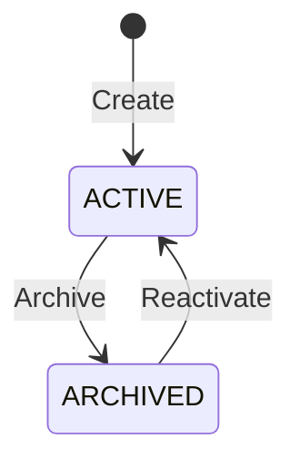

# Detail Accounts Capability

## 1. Purpose

Detail Accounts provide the final accounting dimension used to identify the specific person, symbol, or bank account involved in a ledger posting.

The capability maintains a global directory of accounting identities. Every Accounting Book uses the same Detail Account directory.

This document defines the business meaning, scope, invariants, lifecycle, and use cases of Detail Accounts. Implementation rules are defined separately in `docs/architecture_guide.md`.

## 2. Capability Model

Detail Accounts use one unified business model:

```text
Detail Account
├── Code
├── Name
├── Type
└── Status
```

The initial supported types are:

- `PERSON`
- `SYMBOL`
- `BANK`

These types share the same identity and lifecycle rules. Separate Person, Symbol, and Bank entities are not required inside this capability.

## 3. Scope

The Detail Accounts capability owns:

- Detail Account identity.
- Globally unique Detail Account codes.
- Human-readable Detail Account names.
- Detail Account type.
- Detail Account activation and archival.
- Creation and maintenance of accounting-facing Person, Symbol, and Bank identities.
- Discovery and search of Detail Accounts.
- Validation of whether a Detail Account is available for a new ledger posting.
- Explicit introduction of new Detail Account types.

## 4. Non-Scope

The capability does not own:

- Full personal or investor profiles.
- Identity verification or customer onboarding.
- Full financial-instrument reference data.
- Market data, prices, or trading status.
- Full bank-account operational information.
- Payment eligibility, interest calculation, or banking operations.
- Accounting Books.
- Chart of Accounts structure.
- Accounting documents or ledger lines.
- Account balances or financial reports.
- Book-specific copies or customization of Detail Accounts.

Only information required to identify and classify a Detail Account for accounting is maintained here.

## 5. Business Terminology

### Detail Account

A globally identifiable accounting dimension referenced by a ledger line when required by its Subsidiary Account.

### Detail Account Code

A permanent, globally unique business code used in ledger lines and accounting queries.

The code is independent of Detail Account type. Two Detail Accounts of different types cannot share the same code.

### Detail Account Name

The current human-readable name displayed in accounting selection and reporting.

The name may change without changing the Detail Account code or historical ledger lines.

### Detail Account Type

The current accounting classification of a Detail Account:

- `PERSON`: a person or legal party represented for accounting.
- `SYMBOL`: a financial instrument represented for accounting.
- `BANK`: a bank account represented for accounting.

Type determines compatibility with the Detail-Account Type required by a Subsidiary Account.

### Active

The Detail Account is available for compatible new ledger postings.

### Archived

The Detail Account remains available for historical lookup and reporting but cannot be selected for new ledger postings.

## 6. Business Information

A Detail Account records:

| Information | Business meaning |
| --- | --- |
| ID | Permanent internal system identity |
| Code | Permanent globally unique accounting code |
| Name | Current human-readable accounting name |
| Type | Current classification: person, symbol, or bank |
| Status | Current lifecycle state |
| Created at | Time at which the Detail Account was created |
| Updated at | Time of its most recent change |
| Archived at | Time at which it was archived |

## 7. Business Invariants

The following rules must always hold:

1. Every Detail Account has a permanent internal identity.
2. Every Detail Account has a non-empty code.
3. Every Detail Account has a non-empty name.
4. Every Detail Account has exactly one supported type.
5. Every Detail Account has exactly one lifecycle status.
6. Detail Account codes are global across all Accounting Books and types.
7. No two Detail Accounts may have the same normalized code.
8. Codes are trimmed and normalized consistently before comparison and storage.
9. A Detail Account code is immutable after creation.
10. A Detail Account may be renamed.
11. A Detail Account's type may be changed to another supported type.
12. Changing name or type does not change the Detail Account code.
13. Changing name or type does not rewrite or invalidate historical ledger lines.
14. An active Detail Account may be used only with a Subsidiary Account requiring the same type.
15. An archived Detail Account cannot be used for a new ledger posting.
16. An archived Detail Account remains resolvable by code for historical reporting.
17. A Detail Account referenced by accounting data cannot be physically deleted.
18. Archival is the normal way to retire a used Detail Account.
19. A completely unused Detail Account may be deleted only when no persisted dependency references its code.
20. New Detail Account types must be introduced through an explicit business and schema decision.
21. System-assigned identities and timestamps are not supplied by clients.

## 8. Global Scope

Detail Accounts are global within Apex Accounting.

Rules:

- A Detail Account does not belong to an Accounting Book.
- The same Detail Account code may be referenced by ledger lines from multiple Accounting Books.
- Accounting Books do not own copies of Detail Accounts.
- An Accounting Book cannot independently rename, reclassify, archive, or reactivate a Detail Account.
- Changes to a Detail Account are visible to all Accounting Books.
- Authorization to use an Accounting Book does not automatically grant permission to manage the global Detail Account directory.

## 9. Code Semantics

The Detail Account code is the stable accounting reference.

- Code uniqueness is global, not scoped by type or Accounting Book.
- Type is not part of the unique key.
- A code cannot be reused after archival or deletion if historical or external accounting references may still exist.
- A change of type preserves the code.
- A change of name preserves the code.
- Ledger lines reference the code directly.

Because ledger lines store the immutable code rather than the internal Detail Account ID, code stability is a permanent compatibility requirement.

## 10. Name and Type Changes

Name and type are current master-data attributes and may change.

### Name change

- A name change affects future selection and display.
- Historical ledger lines remain unchanged because they store only the code.
- Historical reports resolving the code through the current directory display the current name.

### Type change

- A type change affects eligibility for future ledger postings.
- Historical ledger lines remain valid and are not revalidated against the new type.
- Future postings must validate the current Detail Account type against the current Subsidiary Account requirement.
- A type change must not alter the Detail Account code.

Changes that require historical names or types as originally recorded must be handled by audit history or reporting snapshots outside ledger-line identity. Ledger lines do not snapshot Detail Account name or type.

## 11. Lifecycle



### Lifecycle rules

- A new Detail Account begins as `ACTIVE`.
- An active Detail Account is eligible for compatible new postings.
- Archival prevents new postings but preserves historical resolution.
- Reactivation makes the Detail Account available for compatible new postings again.
- Repeating an invalid transition produces a business failure; it is not treated as a successful no-op.
- Physical deletion is not part of the normal lifecycle.

## 12. Use Cases

### 12.1 Create Detail Account

#### Business intent

Add a new accounting identity to the global Detail Account directory.

#### Required information

- Code.
- Name.
- Type.

#### Business outcome

- A new active Detail Account is created.
- Its code is normalized and becomes permanently immutable.
- It becomes available for compatible ledger postings.

#### Business failures

- Required information is invalid or missing.
- The normalized code is already assigned to another Detail Account of any type or status.
- The supplied type is unsupported.
- The caller is not permitted to manage Detail Accounts.

### 12.2 Update Detail Account

#### Business intent

Change the current name or type of an existing Detail Account.

#### Changeable information

- Name.
- Type.

#### Business outcome

- The current name and type are updated.
- The code and internal identity remain unchanged.
- Historical ledger lines remain valid.
- Future posting compatibility uses the updated type.

#### Business failures

- The Detail Account does not exist.
- The supplied name is invalid.
- The supplied type is unsupported.
- The request attempts to change the code.
- The caller is not permitted to manage Detail Accounts.

### 12.3 Get Detail Account

#### Business intent

View one Detail Account by its internal identity or exact code.

#### Business outcome

The authorized caller receives its identity, code, current name, current type, status, and relevant timestamps.

#### Business failures

- The Detail Account does not exist.
- The caller is not permitted to view it.

### 12.4 List Detail Accounts

#### Business intent

Browse the global Detail Account directory.

#### Supported criteria

- Type.
- Status.
- Code or name search.
- Page and page size.

#### Business outcome

The caller receives a consistently ordered, paginated list and the corresponding total count.

### 12.5 Search Detail Accounts for Posting

#### Business intent

Find Detail Accounts eligible for a ledger line under a selected Subsidiary Account.

#### Required information

- Required Detail-Account Type, normally derived from the Subsidiary Account.
- Optional code or name search text.

#### Business outcome

The caller receives active Detail Accounts whose current type matches the required type.

Archived or type-incompatible accounts are excluded.

### 12.6 Validate Detail Account for Posting

#### Business intent

Confirm that a supplied Detail Account code may be used on a new ledger line.

#### Business outcome

Validation succeeds only when:

- the code resolves to a Detail Account;
- the Detail Account is active; and
- its current type exactly matches the type required by the Subsidiary Account.

#### Business failures

- The code does not exist.
- The Detail Account is archived.
- The Detail Account type does not match the Subsidiary Account requirement.

This is an internal Accounting operation and is not required as a public user-facing endpoint.

### 12.7 Archive Detail Account

#### Business intent

Retire a Detail Account from future posting while preserving accounting history.

#### Business outcome

- The status becomes `ARCHIVED`.
- The account remains resolvable by code.
- Existing ledger lines remain valid.

#### Business failures

- The Detail Account does not exist.
- It is already archived.
- The caller is not permitted to manage Detail Accounts.

### 12.8 Reactivate Detail Account

#### Business intent

Return an archived Detail Account to posting use.

#### Business outcome

The status becomes `ACTIVE`, and the account becomes eligible for new postings compatible with its current type.

#### Business failures

- The Detail Account does not exist.
- It is already active.
- The caller is not permitted to manage Detail Accounts.

### 12.9 Delete Unused Detail Account

#### Business intent

Remove a Detail Account created in error before it acquires any persisted dependency.

#### Business outcome

The unused Detail Account is permanently removed.

#### Business failures

- The Detail Account does not exist.
- Its code is referenced by any ledger line, configuration, import mapping, or other persisted dependency.
- Its code may be required for historical or external accounting compatibility.
- The caller is not permitted to manage Detail Accounts.

Deletion is exceptional. Archival is preferred whenever usage or compatibility is uncertain.

## 13. Authorization Rules

- Only authenticated users may access Detail Accounts.
- Reading and managing Detail Accounts may require different permissions.
- Management permission is global because the directory is shared by all Accounting Books.
- Access to one Accounting Book does not grant permission to change global Detail Accounts.
- Posting workflows may search and validate Detail Accounts only within the caller's authorized accounting operation.
- Historical reporting may resolve archived Detail Accounts by code.

Exact permission names are defined by the application-wide authorization model.

## 14. Relationship with Chart of Accounts

- A Subsidiary Account declares a required Detail-Account Type.
- `NONE` means a ledger line must not contain a Detail Account code.
- `PERSON`, `SYMBOL`, or `BANK` means a ledger line must contain an active Detail Account code of the same current type.
- The Chart of Accounts does not own Detail Account records.
- Changing a Subsidiary Account does not modify Detail Accounts.
- Changing a Detail Account does not modify the Chart of Accounts.

## 15. Relationship with Accounting Documents

- A ledger line stores `DetailAccountCode`, not `DetailAccountId`.
- The code must be validated when a new ledger line is created or changed.
- The code is stored without a database relationship to the global Detail Account record when the ledger line resides in a shard.
- Historical ledger lines remain interpretable because codes are immutable and never reassigned.
- Ledger lines do not store Detail Account name or type snapshots.
- Reports resolve current name and type through the global Detail Account directory unless a separate historical audit view is explicitly required.
- Archiving or reclassifying a Detail Account does not modify existing ledger lines.

## 16. Data Placement

Detail Accounts belong in the General Database because they are global and shared by all Accounting Books.

Ledger lines may reside in Fiscal Year shards and retain the Detail Account code as their stable reference. No cross-database foreign key is required or permitted.

## 17. Migration Expectations from Kotlin

The Kotlin system obtains accounting detail codes from multiple entity types:

- persons;
- symbols;
- bank accounts.

Apex consolidates their accounting-facing identities into the unified Detail Account directory.

Migration must preserve:

- every Detail Account code referenced by historical ledger lines;
- the current display name;
- the mapped type: `PERSON`, `SYMBOL`, or `BANK`;
- active or archived status when it can be determined reliably;
- compatibility with historical ledger codes.

Migration must detect and report:

- one code resolving to multiple source records;
- one code resolving to conflicting types;
- missing or empty codes;
- historical ledger codes with no source record;
- unsupported source types;
- conflicting names that require an explicit mapping decision.

Migration anomalies must not be silently corrected. Because Apex codes are globally unique across types, every collision requires an explicit business resolution.

## 18. Stable Business Failures

| Error code | Business meaning |
| --- | --- |
| `detail_account_not_found` | The requested Detail Account code or identity does not exist |
| `detail_account_code_already_exists` | The normalized code is already assigned globally |
| `detail_account_invalid_code` | The supplied code is missing or invalid |
| `detail_account_invalid_name` | The supplied name is missing or invalid |
| `detail_account_type_not_supported` | The supplied type is not explicitly supported |
| `detail_account_code_immutable` | An operation attempted to change an existing code |
| `detail_account_already_active` | The Detail Account is already active |
| `detail_account_already_archived` | The Detail Account is already archived |
| `detail_account_archived` | An archived Detail Account was selected for a new posting |
| `detail_account_type_mismatch` | The current Detail Account type does not match the Subsidiary Account requirement |
| `detail_account_not_allowed` | The Subsidiary Account does not accept a Detail Account |
| `detail_account_required` | The Subsidiary Account requires a Detail Account code |
| `detail_account_cannot_be_deleted` | A persisted or compatibility dependency prevents deletion |

These codes form part of the capability's observable contract and must remain stable unless an explicit compatibility decision changes them.

## 19. Settled Business Decisions

1. Detail Account codes are global across all Accounting Books and types.
2. Detail Accounts are owned and maintained inside the Accounting module.
3. Code uniqueness is based on code alone, not `(Type, Code)`.
4. Code is permanently immutable.
5. Name and type may change, including after accounting use.
6. Historical ledger lines are not revalidated or rewritten after a name or type change.
7. Used Detail Accounts cannot be deleted and are retired through archival.
8. Ledger lines store the immutable Detail Account code, not its internal ID.
9. Ledger lines do not snapshot Detail Account name or type.
10. The initial types are `PERSON`, `SYMBOL`, and `BANK`.
11. New types must be added through an explicit business and schema decision.
12. Detail Accounts are global and have no Accounting Book ownership field.

These decisions are authoritative. Coding agents must update this document when a later business decision changes them.
