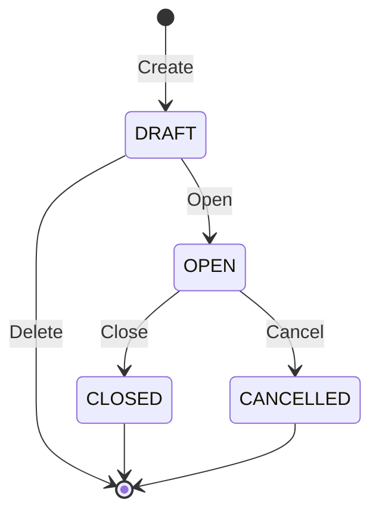

# Fiscal Years Capability

## 1. Purpose

A Fiscal Year defines a dated accounting period within an Accounting Book. It determines when accounting activity belongs, whether the period is available for posting, which dates are protected from further change, and the numbering sequence used for accounting documents.

This document defines the business meaning, scope, invariants, lifecycle, and use cases of Fiscal Years. Implementation rules are defined separately in `docs/architecture_guide.md`.

## 2. Scope

The Fiscal Years capability owns:

- Fiscal Year identity.
- Association with an Accounting Book.
- Start and end dates.
- Fiscal Year lifecycle.
- The finalized-through date.
- Resolution of a Fiscal Year for an accounting date.
- Sequential document-number allocation within a Fiscal Year.
- Rules governing creation, modification, opening, cancellation, and deletion.
- Discovery and listing of Fiscal Years.

## 3. Non-Scope

The capability does not currently own:

- Closing temporary accounts.
- Closing performance accounts.
- Creating final closing documents.
- Creating opening documents.
- Automatically creating the next Fiscal Year.
- Copying expenses or configuration into a subsequent year.
- Trial-balance calculation.
- Journal-entry content or balancing rules.
- Accounting Book lifecycle.
- Physical shard provisioning or administration.

Fiscal Year closing and the opening of a subsequent year will be designed as a later Accounting workflow.

## 4. Business Terminology

### Fiscal Year

A dated accounting period belonging to exactly one Accounting Book.

### Accounting Date

The business date on which an accounting document is recognized. It determines the Fiscal Year to which the document belongs.

### Finalized-Through Date

The latest accounting date protected from ordinary creation, modification, or deletion of accounting activity.

All dates on or before this date are finalized. Finalization advances forward and does not move backward through normal business operations.

### Reference Number and Journal Entry Number

Two independent sequential numbers allocated within one Fiscal Year. Both sequences restart at `1`
for every Fiscal Year and are advanced by Journal Entry creation.

Allocation and Journal Entry insertion share the authoritative shard transaction. A failed creation
rolls both counters back, while a committed number is never reused.

### Draft

The Fiscal Year has been defined but is not operational. Its title and dates may still be changed. An unused draft may be deleted; it is not cancelled.

### Open

The Fiscal Year is operational and may accept accounting activity for eligible dates.

### Closed

The Fiscal Year has completed the formal closing process. It is permanent and no longer accepts ordinary accounting activity.

### Cancelled

The Fiscal Year was terminated at an effective cancellation date without completing the ordinary closing process. It is permanent and no longer accepts accounting activity.

## 5. Business Information

A Fiscal Year records:

| Information | Business meaning |
| --- | --- |
| ID | Permanent system identity |
| Accounting Book ID | Identity of the owning Accounting Book |
| Title | Human-readable name of the period |
| Start date | First included accounting date |
| End date | Last included accounting date before any cancellation |
| Status | Current lifecycle state |
| Finalized-through date | Latest protected accounting date |
| Next document number | Next number available for allocation |
| Created at | Time at which the Fiscal Year was created |
| Updated at | Time of its most recent change |
| Opened at | Time at which it became operational |
| Closed at | Time at which ordinary closing completed |
| Cancelled at | Time at which cancellation was performed |
| Cancellation date | Effective final accounting date when cancelled |

## 6. Business Invariants

The following rules must always hold:

1. Every Fiscal Year has a permanent identity.
2. Every Fiscal Year belongs to exactly one Accounting Book.
3. The start date is on or before the end date.
4. Fiscal Years belonging to the same Accounting Book must not overlap.
5. Gaps between Fiscal Years are allowed.
6. A Fiscal Year has no prescribed minimum or maximum duration.
7. A new Fiscal Year always begins in `DRAFT` status.
8. Draft dates may be changed while all Fiscal Year invariants remain satisfied.
9. Dates may not be changed after the Fiscal Year leaves `DRAFT` status.
10. At most one Fiscal Year in an Accounting Book may be `OPEN` at a time.
11. Opening a Fiscal Year never closes another Fiscal Year automatically.
12. If another Fiscal Year in the same Accounting Book is already open, opening must fail.
13. An open Fiscal Year accepts ordinary accounting activity only within its effective date range.
14. Accounting activity on or before the finalized-through date is protected from ordinary creation, modification, and deletion.
15. The finalized-through date initially equals the day before the start date.
16. The finalized-through date may advance but may not move backward through normal business operations.
17. The finalized-through date may not move beyond the effective final date of the Fiscal Year.
18. Reference and Journal Entry numbering each begin at `1` independently for every Fiscal Year.
19. Each number is unique within its Fiscal Year and number kind.
20. Both numbers are allocated in increasing order in the Journal Entry creation transaction.
21. A committed number is never reused.
22. Closed and cancelled Fiscal Years are terminal.
23. Deletion is permitted only for an eligible draft Fiscal Year.
24. Deletion permanently removes the draft definition and is different from cancellation.
25. Business timestamps and allocated numbers are assigned by the system, not by clients.
26. A Fiscal Year title is required, trimmed, limited to 256 characters, and does not need to be unique.
27. A Fiscal Year may be created only for a `DRAFT`, `ACTIVE`, or `SUSPENDED` Accounting Book.
28. A Fiscal Year may not be created for an `ARCHIVED` Accounting Book.
29. A Fiscal Year may be opened only when its Accounting Book is `ACTIVE`.
30. Only an `OPEN` Fiscal Year may be cancelled.
31. Cancellation must take effect exactly on the finalized-through date.
32. The original end date is preserved after cancellation; the cancellation date separately defines the effective final date.
33. Finalization is irreversible through ordinary or administrative Fiscal Year operations.
34. Closed and cancelled Fiscal Years remain available for authorized historical reading and reporting.
35. Fiscal Year lifecycle operations do not publish business events unless a concrete consumer and delivery requirement are introduced later.

## 7. Effective Date Range

For a normal draft, open, or closed Fiscal Year, the effective date range is its start date through its end date, inclusive.

For a cancelled Fiscal Year, the cancellation date becomes its effective final accounting date.

An accounting date belongs to a Fiscal Year only when:

- it falls within the Fiscal Year's effective date range; and
- the Fiscal Year is in a status accepted by the requesting business operation.

Because gaps are allowed, resolving a Fiscal Year for a date may legitimately produce no result.

Because overlaps are prohibited, resolving a Fiscal Year for one Accounting Book and date must never produce more than one result.

## 8. Lifecycle

### Allowed transitions

| Current status | Operation | Resulting status |
| --- | --- | --- |
| `DRAFT` | Open | `OPEN` |
| `DRAFT` | Delete | Removed |
| `OPEN` | Close | `CLOSED` |
| `OPEN` | Cancel | `CANCELLED` |

All other transitions are invalid.

### Lifecycle rules

- Opening requires that no other Fiscal Year in the Accounting Book is open.
- Opening requires the owning Accounting Book to be active.
- Opening does not alter any other Fiscal Year.
- Closing is reserved for the later Fiscal Year Closing workflow.
- Cancellation is not a substitute for ordinary closing.
- Draft Fiscal Years are deleted rather than cancelled.
- Closed and cancelled Fiscal Years cannot be reopened, modified, or deleted.
- Repeating an invalid transition produces a business failure; it is not treated as a successful no-op.

## 9. Use Cases

### 9.1 Create Fiscal Year

#### Business intent

Define a future accounting period for an Accounting Book.

#### Required information

- Accounting Book ID.
- Title.
- Start date.
- End date.

#### Business outcome

- A new Fiscal Year is created in `DRAFT` status.
- Its finalized-through date is the day before its start date.
- Its first available Reference Number and Journal Entry Number are both `1`.

#### Business failures

- The Accounting Book does not exist.
- The Accounting Book is archived.
- The caller is not permitted to manage the Accounting Book.
- Required information is invalid or missing.
- The date range overlaps another Fiscal Year of the same Accounting Book.

### 9.2 Update Draft Fiscal Year

#### Business intent

Correct the definition of a Fiscal Year before it becomes operational.

#### Changeable information

- Title.
- Start date.
- End date.

#### Business outcome

- The draft definition is updated.
- If the start date changes, the initial finalized-through date changes to the day before the new start date.

#### Business failures

- The Fiscal Year does not exist.
- The caller is not permitted to manage it.
- The Fiscal Year is not in `DRAFT` status.
- The resulting date range is invalid.
- The resulting date range overlaps another Fiscal Year of the same Accounting Book.

### 9.3 Delete Draft Fiscal Year

#### Business intent

Remove a Fiscal Year definition that was created but never became operational.

#### Business outcome

The draft Fiscal Year is permanently removed.

#### Business failures

- The Fiscal Year does not exist.
- The caller is not permitted to manage it.
- The Fiscal Year is not in `DRAFT` status.
- The Fiscal Year has any dependent accounting data, configuration, assignment, or other persisted dependency.

### 9.4 Get Fiscal Year

#### Business intent

View one Fiscal Year by its permanent identity.

#### Business outcome

The authorized caller receives its identity, Accounting Book association, dates, lifecycle status,
finalization boundary, both authoritative numbering positions, and relevant timestamps.

#### Business failures

- The Fiscal Year does not exist.
- The caller is not permitted to view it.

### 9.5 List Fiscal Years

#### Business intent

Discover Fiscal Years visible to the caller.

#### Supported criteria

- Accounting Book.
- Lifecycle status.
- Date range.
- Page and page size.

#### Business outcome

The caller receives an authorized, consistently ordered, paginated list of Fiscal Years and the corresponding total count.

The caller may narrow the authorized result set but may not expand it by supplying an Accounting Book criterion.

### 9.6 Open Fiscal Year

#### Business intent

Make a draft Fiscal Year available for accounting operations.

#### Business outcome

- The status becomes `OPEN`.
- The opening time is recorded.
- Its dates become immutable.

#### Business failures

- The Fiscal Year does not exist.
- The caller is not permitted to manage it.
- The Fiscal Year is not in `DRAFT` status.
- Another Fiscal Year in the same Accounting Book is already open.
- The Accounting Book is not `ACTIVE`.

Opening never closes or otherwise changes the existing open Fiscal Year.

### 9.7 Resolve Fiscal Year for Date

#### Business intent

Identify the Fiscal Year of an Accounting Book that contains a given accounting date.

#### Required information

- Accounting Book ID.
- Accounting date.
- Required lifecycle eligibility, when the requesting operation needs it.

#### Business outcome

Exactly one matching Fiscal Year is returned when one exists and satisfies the requested lifecycle condition.

#### Business failures

- No Fiscal Year contains the date.
- A matching Fiscal Year exists but is not eligible for the requesting operation.
- More than one Fiscal Year contains the date, indicating corrupted business data.

### 9.8 Finalize Through Date

The public operation coordinates Fiscal Year state, Journal Entry numbering, and financial
projection verification in one authoritative shard transaction.

#### Business intent

Protect completed accounting activity through a specified date.

#### Required information

- Fiscal Year ID.
- New finalized-through date.

#### Business outcome

- The finalized-through date advances exactly one contiguous accounting day.
- Dates on or before the new boundary become protected from ordinary change.
- Posted entries in the unfinalized tail are deterministically renumbered and numbers through the
  new boundary are frozen.

#### Business failures

- The Fiscal Year does not exist.
- The caller is not permitted to finalize it.
- The Fiscal Year is not open.
- The new date is neither the current boundary nor exactly its next day.
- The new date is outside the effective range of the Fiscal Year.
- Draft Journal Entries exist on the day being finalized.
- Financial projections through the requested date do not reconcile with posted source entries.

Requesting the current finalized-through date may be treated as an idempotent success.

Finalization currently verifies Journal Entry readiness and both financial projections. Future
accounting processes that can affect a date must expose readiness checks and join this coordinated
workflow before their data may be considered final.

Finalization cannot be reversed. A correction to finalized accounting data must use an explicit corrective accounting workflow rather than moving the finalized-through date backward.

### 9.9 Allocate Journal Entry Numbers

#### Business intent

Allocate the next Reference Number and provisional Journal Entry Number within a Fiscal Year.

This is an internal Accounting operation and is not a public user-facing operation.

#### Business outcome

- Both current numbers are returned.
- Both next available numbers advance by one.
- Allocation and Journal Entry insertion commit atomically on the Fiscal Year's shard.

#### Business failures

- The Fiscal Year does not exist.
- The Fiscal Year is not eligible for the document being created.

A failed Journal Entry transaction rolls the allocation back. Once the transaction commits, neither
number is reused. An ambiguous commit result must be resolved through the source-idempotency contract.

### 9.10 Cancel Fiscal Year

#### Business intent

Permanently terminate an open Fiscal Year at a specified effective date without ordinary year-end closing.

#### Required information

- Fiscal Year ID.
- Cancellation date.

#### Business outcome

- The status becomes `CANCELLED`.
- The cancellation date becomes the effective final accounting date.
- The cancellation time is recorded.

#### Business failures

- The Fiscal Year does not exist.
- The caller is not permitted to cancel it.
- The Fiscal Year is not open.
- The cancellation date is outside the Fiscal Year's original date range.
- The cancellation date is not equal to the finalized-through date.
- Accounting activity exists after the cancellation date.

Cancellation does not delete the Fiscal Year or erase its accounting history.

Cancellation preserves the original end date. The separate cancellation date becomes the effective final date used for accounting-date resolution and historical interpretation.

### 9.11 Close Fiscal Year

Closing is recognized as a future business operation but is not part of the current implementation scope.

The later closing workflow must define:

- Readiness conditions.
- Temporary-account closing.
- Performance-account closing where applicable.
- Final closing entries.
- Creation or selection of the next Fiscal Year.
- Opening entries.
- Failure recovery and idempotency.

The Fiscal Year may become `CLOSED` only after that workflow completes successfully.

### 9.12 Repair Fiscal Year Directory

#### Business intent

Rebuild the General Database directory row for a Fiscal Year from its authoritative shard row after best-effort directory synchronization has drifted.

This is an internal, administrative Accounting operation and is not an ordinary business use case.

#### Business outcome

- The directory row for the Fiscal Year is overwritten to match its authoritative shard row.
- No authoritative Fiscal Year state changes.

#### Business failures

- The Fiscal Year does not exist.
- The caller is not permitted to perform directory repair.

## 10. Authorization Rules

- Only authenticated users may access Fiscal Years.
- Reading, creating, modifying, opening, finalizing, cancelling, and later closing may require different permissions.
- Access to a Fiscal Year is constrained by access to its Accounting Book.
- A caller may view or change only Fiscal Years belonging to Accounting Books within their authorized business scope.
- Listing must never reveal Fiscal Years outside the caller's authorized scope.
- Internal document-number allocation is available only to trusted Accounting operations.
- Directory repair is an administrative operation and is available only to trusted Accounting operators, not ordinary Fiscal Year callers.

Exact permission names are defined by the application-wide authorization model.

Closed and cancelled Fiscal Years are readable under the same Accounting Book read scope used for other historical accounting information. Their terminal status prevents mutation but does not hide them from authorized reporting.

## 11. Relationship with Accounting Books

- Every Fiscal Year belongs to one Accounting Book.
- A Fiscal Year cannot exist without an Accounting Book.
- The Accounting Book remains authoritative for ownership and its own lifecycle.
- Fiscal Year operations must respect relevant Accounting Book status rules.
- Deleting or archiving an Accounting Book must account for its Fiscal Years and their history.
- Fiscal Years do not change Accounting Book lifecycle automatically.

- Fiscal Years may be created while the Accounting Book is `DRAFT`, `ACTIVE`, or `SUSPENDED`.
- Fiscal Years may not be created for an `ARCHIVED` Accounting Book.
- Opening requires the Accounting Book to be `ACTIVE`.

## 12. Relationship with Accounting Documents

- Every accounting document belongs to one Fiscal Year.
- Its accounting date must fall within that Fiscal Year's effective date range.
- Ordinary documents may be posted only when the Fiscal Year is open.
- Ordinary accounting activity is prohibited on or before the finalized-through date.
- Each Journal Entry receives both numbers allocated within its Fiscal Year.
- Numbers are unique only within the Fiscal Year and number kind; the same values may exist in different Fiscal Years.
- Closing and opening documents may require explicit exceptions defined by the future closing workflow.

## 13. Data Placement and Partitioning

The authoritative Fiscal Year row, including lifecycle state, finalization boundary, and both number
counters, belongs in the shard selected by Fiscal Year ID. Journal Entries for that Fiscal Year use
the same shard and transaction boundary.

The General Database contains an eventually consistent `fiscal_year_directory` used only for list,
date resolution, and book-wide overlap/open checks. Authoritative shard commits are not rolled back
when best-effort directory synchronization fails; an explicit repair operation rebuilds a directory
row from its authoritative shard row.

A Fiscal Year is an explicit business partition for accounting data that may be stored in a shard. Shard routing must use the Fiscal Year explicitly and must not be inferred from an accounting document ID or other ambient state.

Book-wide overlap and single-open-year checks span independent Fiscal Year shards. The current design
accepts the narrow race between those directory checks and authoritative shard commits.

## 14. Stable Business Failures

| Error code | Business meaning |
| --- | --- |
| `fiscal_year_not_found` | The requested Fiscal Year does not exist or is not visible under the applicable contract |
| `fiscal_year_invalid_date_range` | The start and end dates do not form a valid range |
| `fiscal_year_dates_overlap` | The date range overlaps another Fiscal Year in the Accounting Book |
| `fiscal_year_cannot_be_updated` | The Fiscal Year is no longer an editable draft |
| `fiscal_year_cannot_be_deleted` | The Fiscal Year is not an eligible unused draft |
| `fiscal_year_cannot_be_opened` | Opening is invalid in the current state or under current Accounting Book conditions |
| `fiscal_year_open_already_exists` | Another Fiscal Year in the Accounting Book is already open |
| `fiscal_year_not_found_for_date` | No eligible Fiscal Year contains the requested accounting date |
| `fiscal_year_date_finalized` | The requested accounting date is protected by finalization |
| `fiscal_year_cannot_be_finalized` | The requested finalization violates status, range, or readiness rules |
| `fiscal_year_cannot_be_cancelled` | Cancellation violates lifecycle or accounting-history rules |
| `fiscal_year_cannot_be_closed` | The future closing workflow cannot close the Fiscal Year |

These codes form part of the capability's observable contract and must remain stable unless an explicit compatibility decision changes them.

## 15. Deferred Closing Design

The current Fiscal Years capability must not implement partial closing behavior.

Closing will be introduced later as an explicit Accounting workflow. That design must consider the Kotlin system's business responsibilities without copying its combined service implementation.

Until then:

- No user-facing operation may directly set a Fiscal Year to `CLOSED`.
- No operation may generate closing or opening documents as a side effect of ordinary Fiscal Year management.
- No next Fiscal Year is created automatically.
- No expense, balance, or accounting configuration is copied automatically.

## 16. Settled Business Decisions

1. Fiscal Years may be created for `DRAFT`, `ACTIVE`, and `SUSPENDED` Accounting Books, but not archived books.
2. A Fiscal Year may be opened only when its Accounting Book is `ACTIVE`.
3. A draft may be deleted only when it has no persisted dependencies, including non-posted configuration.
4. Draft Fiscal Years are deleted, not cancelled. Cancellation applies only to open years.
5. Daily finalization is coordinated with Journal Entry numbering and financial projection
   reconciliation; future accounting processes must participate in readiness validation.
6. Finalization is irreversible. Corrections use accounting workflows rather than moving the boundary backward.
7. Cancellation preserves the original end date and records a separate cancellation date as the effective final date.
8. Closed and cancelled Fiscal Years remain readable for authorized historical reporting.
9. No Fiscal Year lifecycle event is published until a concrete consumer requires one.
10. The title is required, trimmed, limited to 256 characters, and not unique.

These decisions are authoritative. Coding agents must update this document when a later business decision changes them.
