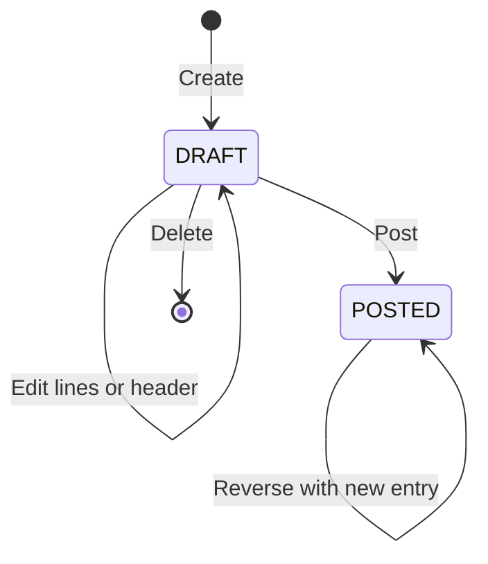

# Journal Entries Capability

## 1. Purpose

Journal Entries record the authoritative financial and statistical accounting activity of an Accounting Book.

Each Journal Entry contains an ordered collection of debit and credit lines. Posted Journal Entries and their lines are the only source of truth for ledger activity. Daily reporting projections accelerate balances and reports but never replace, amend, or become authoritative over the posted Journal Entries.

This document defines the business meaning, scope, invariants, lifecycle, numbering, posting, reversal, daily finalization, reporting projections, and required use cases of Journal Entries. General implementation rules are defined separately in `docs/architecture_guide.md`, `docs/persistency_design.md`, and `docs/integration_testing_guide.md`.

## 2. Scope

The Journal Entries capability owns:

- Journal Entry identity and lifecycle.
- Ordered Journal Entry Lines.
- Reference-number allocation.
- Provisional and finalized Journal Entry numbering.
- Manual, semi-system, system, and migration insertion classification.
- Financial and statistical balance-effect classification.
- Supported accounting document types.
- Draft creation and maintenance.
- Posting and balance validation.
- Reversal of posted entries.
- Physical deletion of eligible drafts.
- Daily finalization of Journal Entry numbers.
- Financial daily-turnover and daily-balance projections.
- Projection rebuilding and reconciliation.
- Aggregate accounting-report inputs.
- Journal and ledger transaction-detail queries.
- Idempotency for system-generated Journal Entries.

## 3. Non-Scope

The capability does not own:

- Accounting Book lifecycle.
- Fiscal Year lifecycle or formal year-end closing workflow.
- Chart of Accounts maintenance.
- Detail Account maintenance.
- Currency conversion or foreign-exchange valuation.
- Tax calculation.
- Attachments.
- Portfolio-specific Kotlin document types beyond the initial Apex set.
- Full report presentation, spreadsheet generation, or UI formatting.
- Statistical reporting projections in the initial implementation.
- Editing or deleting posted accounting history.

## 4. Dependencies and Ownership

Journal Entries are inside the Accounting module and may use Accounting-owned interfaces for:

- Accounting Books.
- Fiscal Years.
- Chart of Accounts.
- Detail Accounts.

The capability must not reach directly into another capability's database objects. Cross-capability interaction stays inside the Accounting module and uses explicit interfaces.

The capability depends on Fiscal Years for:

- Resolving the Fiscal Year for an Accounting Book and Accounting Date.
- Determining whether the Fiscal Year is open.
- Reading the Finalized-Through Date.
- Allocating Reference Numbers.
- Coordinating provisional Journal Entry numbering and daily finalization.

The existing Fiscal Years specification must be amended when this capability is implemented. Its current single `Document Number` concept becomes the immutable `Reference Number` sequence, and it must also expose the state required for provisional and finalized Journal Entry numbering.

## 5. Business Terminology

### Journal Entry

An accounting document containing ordered debit and credit lines for one Accounting Book, one Fiscal Year, and one Accounting Date.

### Journal Entry Line

One ordered debit or credit posting to a complete account-code path, optionally qualified by a Detail Account when the selected Subsidiary Account requires one.

### Reference Number

A permanent sequential number allocated when a Journal Entry is created. It is equivalent to the Kotlin system's inflection number.

The Reference Number identifies the Journal Entry throughout its lifetime. It never changes, is never reused, and may contain gaps.

### Journal Entry Number

The official sequential accounting-document number within a Fiscal Year. It is equivalent to the Kotlin system's batch number.

A Journal Entry Number is assigned early as a provisional number. It may change while its Accounting Date remains unfinalized. Daily finalization freezes Journal Entry Numbers through the finalized date.

### Row Number

The permanent presentation order of a line inside one Journal Entry. Row Numbers begin at `1` and are unique within the Journal Entry.

### Side

The accounting side of a line:

- `DEBIT`
- `CREDIT`

This concept corresponds to Kotlin's `JournalArticleType.DEBTOR` and `JournalArticleType.CREDITOR`. Apex uses the standard terms Debit and Credit.

### Document Type

The business reason for the Journal Entry. Initial supported values are:

- `GENERAL`
- `OPENING`
- `CLOSING`
- `TEMPORARY_ACCOUNTS_CLOSING`
- `PERFORMANCE_ACCOUNTS_CLOSING`

Additional document types require an explicit business and schema decision. The portfolio-specific Kotlin types are not introduced implicitly.

### Insertion Type

How the Journal Entry entered Apex:

- `MANUAL`
- `SEMI_SYSTEM`
- `SYSTEM`
- `MIGRATION`

### Status

The lifecycle state of a persisted Journal Entry:

- `DRAFT`
- `POSTED`

Deleted drafts are physically removed and therefore do not require a persisted `DELETED` status. Posted entries are not changed to a reversed status; reversal relationships preserve their history.

### Balance Effect

Whether a posted Journal Entry participates in financial balances:

- `FINANCIAL`
- `STATISTICAL`

Balance Effect is independent of lifecycle Status. A statistical Journal Entry may be draft or posted.

### Daily Finalization

The irreversible operation that orders Journal Entries, freezes Journal Entry Numbers, stabilizes projections, and advances the Fiscal Year's Finalized-Through Date.

### Daily Account Turnover

A rebuildable financial reporting projection containing debit, credit, and net movement for one date, complete account-code path, and Document Type.

### Daily Account Balance

A rebuildable financial reporting projection containing the total financial closing balance for one date and complete account-code path.

### Source Reference

An immutable idempotency reference supplied by a trusted system producer. Together with Source Type, it prevents the same originating operation from creating multiple Journal Entries.

## 6. Journal Entry Information

A Journal Entry records:

| Information | Business meaning |
| --- | --- |
| ID | Permanent internal system identity |
| Accounting Book ID | Accounting Book receiving the activity |
| Fiscal Year ID | Fiscal Year resolved from the Accounting Book and Accounting Date |
| Reference Number | Permanent sequential business reference |
| Journal Entry Number | Provisional or finalized official document number |
| Number Finalized | Whether the Journal Entry Number is frozen |
| Accounting Date | Business date on which the entry is recognized |
| Registered At | Time at which the entry was first registered |
| Description | Required document-level explanation |
| Document Type | Business reason for the entry |
| Insertion Type | Manual, semi-system, system, or migration origin |
| Status | Draft or posted lifecycle state |
| Balance Effect | Financial or statistical effect |
| Source Type | Optional trusted producer classification |
| Source Reference | Optional immutable producer idempotency reference |
| Reversal Of Reference Number | Original entry reversed by this entry, when applicable |
| Reversed By Reference Number | Reversal entry associated with this entry, when applicable |
| Reversal Reason | Required explanation for a reversal |
| Posted At | Time at which the entry became posted |
| Created At | Time at which the entry was created |
| Updated At | Time of the most recent permitted draft change |

System-assigned identities, numbers, lifecycle timestamps, and reversal links are not supplied or modified by ordinary clients.

## 7. Journal Entry Line Information

A Journal Entry Line records:

| Information | Business meaning |
| --- | --- |
| Journal Entry ID | Owning Journal Entry |
| Row Number | Stable order within the Journal Entry |
| Account Class Code | Immutable Account Class business code |
| General Account Code | Immutable General Account business code |
| Subsidiary Account Code | Immutable Subsidiary Account business code |
| Detail Account Code | Immutable global Detail Account code when required |
| Side | Debit or credit |
| Amount | Strictly positive accounting amount |
| Description | Required line-level explanation |

Ledger lines store immutable account business codes, not Chart of Accounts or Detail Account IDs. The internal Journal Entry ID may be used to associate a line with its owning Journal Entry.

Account names and Detail Account names are not snapshotted on Journal Entry Lines. Reports resolve current names through the appropriate Accounting capability. Historical name snapshots, if later required, are a separate reporting concern.

## 8. Numbering

### 8.1 Reference Number

1. Every Journal Entry receives exactly one Reference Number at creation.
2. Reference Numbers begin at `1` independently for each Fiscal Year.
3. A Reference Number is unique within `(Accounting Book, Fiscal Year)`.
4. A Reference Number is immutable after allocation.
5. A deleted draft does not release its Reference Number.
6. A failed creation after allocation may leave a gap.
7. Gaps are allowed and allocated numbers are never reused.
8. Concurrent allocation must not produce duplicates.
9. The existing committed pre-transaction allocation contract in the Fiscal Years capability applies unless that architecture contract is explicitly revised.

### 8.2 Journal Entry Number

1. Every Journal Entry receives a provisional Journal Entry Number at creation.
2. Journal Entry Numbers begin at `1` independently for each Fiscal Year.
3. A Journal Entry Number is unique within `(Accounting Book, Fiscal Year)` at every committed state.
4. A provisional Journal Entry Number may change while its Accounting Date is later than the Fiscal Year's Finalized-Through Date.
5. Daily finalization freezes Journal Entry Numbers through the target date.
6. A finalized Journal Entry Number is immutable.
7. Final numbering order is ascending by:
   1. Accounting Date.
   2. Registered At.
   3. Reference Number as the deterministic tie-breaker.
8. Renumbering must preserve uniqueness throughout the transaction; transient collisions must not leak as committed states.
9. If inserting an earlier unfinalized entry changes ordering, Apex may renumber the entire unfinalized tail of the Fiscal Year.
10. Numbers at or before the Finalized-Through Date must never change.
11. Journal Entry Numbers of later unfinalized dates remain provisional even when renumbered during finalization of an earlier date.

Reference Number is the stable external identity. Consumers must not use a provisional Journal Entry Number as an immutable integration key.

## 9. Business Invariants

The following rules must always hold:

1. Every Journal Entry has a permanent internal identity.
2. Every Journal Entry belongs to exactly one Accounting Book and one Fiscal Year.
3. The Fiscal Year belongs to the same Accounting Book as the Journal Entry.
4. The Accounting Date falls within the Fiscal Year's effective date range.
5. New Journal Entries may be created only in an `OPEN` Fiscal Year.
6. Ordinary creation, modification, posting, reversal, and deletion are prohibited on or before the Finalized-Through Date.
7. Reference Number is required, immutable, and unique within the Accounting Book and Fiscal Year.
8. Journal Entry Number is required and unique within the Accounting Book and Fiscal Year.
9. A finalized Journal Entry Number is immutable.
10. Registered At is immutable.
11. Description is required and normalized consistently.
12. Every Journal Entry has exactly one supported Document Type.
13. Every Journal Entry has exactly one supported Insertion Type.
14. Every Journal Entry has exactly one Status.
15. Every Journal Entry has exactly one Balance Effect.
16. Every persisted Journal Entry has at least one line while draft.
17. Every posted Journal Entry has at least two lines.
18. Row Numbers begin at `1`, are positive, and are unique within a Journal Entry.
19. Row Numbers define line presentation order.
20. A posted line's Row Number is immutable.
21. Appending a draft line assigns `max(RowNumber) + 1` when the caller does not provide a Row Number.
22. Line Amount is strictly greater than zero.
23. Zero-value lines are rejected rather than silently ignored.
24. Negative line Amounts are prohibited; direction is represented only by Side.
25. Every line has exactly one Side: Debit or Credit.
26. Every line has a required description.
27. Every line contains a valid complete Account Class, General Account, and Subsidiary Account code path.
28. The referenced account-code path must exist when the draft is posted.
29. The referenced accounts must be eligible for new posting when the draft is posted.
30. A Detail Account Code is required exactly when the Subsidiary Account requires a Detail Account.
31. A supplied Detail Account must exist, be active, and have the type currently required by the Subsidiary Account.
32. Historical posted lines remain valid when account names, Detail Account names, or Detail Account types later change.
33. A financial Journal Entry may be posted only when total debits equal total credits.
34. A statistical Journal Entry is also required to balance unless a later explicit business decision changes this rule.
35. A posted Journal Entry and its lines are immutable.
36. Posted accounting history is corrected only by reversal and replacement entries.
37. Only drafts may be physically deleted.
38. A deleted draft's allocated numbers are not reused.
39. Statistical entries never contribute to financial Daily Account Turnover or Daily Account Balance.
40. Journal Entries and Journal Entry Lines are the only source of truth for accounting activity.
41. Reporting projections are derived, disposable, and rebuildable.
42. A trusted `(Source Type, Source Reference)` pair identifies at most one Journal Entry within a Fiscal Year.
43. Retrying the same trusted source request must not create a duplicate Journal Entry.
44. Reversal links use immutable Reference Numbers.
45. One original Journal Entry may have at most one effective posted reversal.
46. A reversal must be posted in the same Accounting Book and Fiscal Year as the original entry.
47. A reversal date must belong to that open Fiscal Year and be later than its Finalized-Through Date.
48. Projection changes occur only as part of posting or reversal; draft changes do not affect financial projections.
49. Posting, all line state changes, turnover changes, balance changes, reversal links, and related bookkeeping commit atomically.
50. Financial debit and credit totals across all accounts for one posted Journal Entry are equal.

## 10. Lifecycle



### Lifecycle rules

- A new Journal Entry begins as `DRAFT`.
- Drafts may be changed only while their Accounting Date remains unfinalized.
- Posting is a one-way transition.
- A posted Journal Entry is never returned to draft.
- A posted Journal Entry is never directly edited or deleted.
- Reversal creates a separate posted Journal Entry and links both entries.
- Repeating an invalid transition is a business failure, not a successful no-op.

## 11. Use Cases

### 11.1 Create Draft Journal Entry

#### Required information

- Accounting Book ID.
- Accounting Date.
- Description.
- Document Type.
- Insertion Type.
- Balance Effect.
- One or more lines.
- Optional trusted Source Type and Source Reference.

#### Business outcome

- The open Fiscal Year is resolved.
- A permanent Reference Number is allocated.
- A provisional Journal Entry Number is assigned.
- The Journal Entry and ordered lines are persisted as a draft.
- Financial reporting projections remain unchanged.

#### Business failures

- Accounting Book or eligible Fiscal Year cannot be resolved.
- Accounting Date is outside the Fiscal Year or finalized.
- Required information is invalid.
- Lines are invalid.
- Document Type, Insertion Type, or Balance Effect is unsupported.
- The trusted Source Reference conflicts with a different request.
- The caller lacks permission.

### 11.2 Update Draft Journal Entry

The operation may change:

- Accounting Date within the same eligible Fiscal Year.
- Description.
- Document Type.
- Balance Effect.
- Draft lines and their order.

Reference Number, Registered At, and source idempotency identity remain immutable. Insertion Type is system-owned after creation. Moving a Journal Entry to another Accounting Book or Fiscal Year is not an update; create a replacement draft and delete the old draft when eligible.

Updating an Accounting Date may trigger provisional Journal Entry renumbering within the unfinalized tail.

### 11.3 Append Draft Lines

- Lines may be appended only to a draft on an unfinalized date.
- Omitted Row Numbers use `max(RowNumber) + 1`.
- Explicit Row Numbers must be positive and unique within the entry.
- The operation does not update financial reporting projections.

### 11.4 Replace or Reorder Draft Lines

- Draft lines may be replaced or reordered atomically.
- The resulting Row Numbers must be unique and contiguous from `1` unless a later explicit requirement permits gaps.
- Partial failure leaves the previous draft unchanged.

### 11.5 Post Journal Entry

Posting must revalidate all current business rules inside the command transaction. Validation performed when the draft was created is not sufficient.

Posting validates:

- Journal Entry is still a draft.
- Fiscal Year is open.
- Accounting Date is not finalized.
- At least two non-zero lines exist.
- Row Numbers are valid.
- Account-code paths exist and are eligible.
- Required Detail Accounts exist, are active, and are compatible.
- Total debit equals total credit.
- Source idempotency remains valid.

Posting atomically:

- Changes Status to `POSTED`.
- Records Posted At.
- Makes header and lines immutable.
- Updates financial projections when Balance Effect is `FINANCIAL`.
- Does not update financial projections when Balance Effect is `STATISTICAL`.

### 11.6 Delete Draft Journal Entry

- Only a draft may be deleted.
- Its Accounting Date must be later than the Finalized-Through Date.
- The Journal Entry and its lines are physically removed atomically.
- Allocated Reference and Journal Entry Numbers are not reused.
- Reporting projections remain unchanged.

### 11.7 Reverse Posted Journal Entry

#### Required information

- Original Reference Number.
- Reversal Accounting Date.
- Reversal Reason.

#### Business outcome

- A new Journal Entry receives its own Reference Number and provisional Journal Entry Number.
- It uses the same Accounting Book and Balance Effect as the original.
- It records `ReversalOfReferenceNumber`.
- Every original line is copied with the same account codes, Detail Account Code, Amount, description, and Row Number, but Debit and Credit are exchanged.
- The original records `ReversedByReferenceNumber`.
- The reversal is posted atomically.
- A financial reversal updates both financial projections.
- A statistical reversal does not update financial projections.

The reversal does not modify or remove the original entry or lines.

### 11.8 Get Journal Entry

An authorized caller may retrieve a Journal Entry by:

- Internal ID.
- Exact Reference Number within Accounting Book and Fiscal Year.
- Exact Journal Entry Number within Accounting Book and Fiscal Year.

The result includes ordered lines, lifecycle information, numbering finalization, source identity when authorized, and reversal relationships.

### 11.9 Search Journal Entries

Supported filters should include:

- Accounting Book.
- Fiscal Year.
- Accounting Date range.
- Reference Number.
- Journal Entry Number.
- Status.
- Balance Effect.
- Document Type.
- Insertion Type.
- Account codes.
- Detail Account Code.
- Source Type and Source Reference when authorized.

Results must be paginated and deterministically ordered.

### 11.10 Finalize Accounting Day

#### Required information

- Accounting Book ID.
- Fiscal Year ID.
- Target date.

#### Preconditions

- Fiscal Year is open.
- Target date is exactly the day after the existing Finalized-Through Date unless a separate contiguous multi-day operation is explicitly implemented.
- Target date is within the Fiscal Year's effective range.
- No draft Journal Entry exists on or before the target date after the existing boundary.
- All financial projections through the target date reconcile with posted Journal Entries.

#### Business outcome

- Posted Journal Entries in the unfinalized tail are ordered deterministically.
- Provisional Journal Entry Numbers are reassigned as needed without changing finalized numbers.
- Numbers through the target date are marked finalized.
- Daily reporting projections through the target date are verified.
- The Fiscal Year's Finalized-Through Date advances to the target date.
- The entire operation is atomic and irreversible through ordinary operations.

### 11.11 Rebuild Financial Projections

The capability supports:

- Rebuilding a complete Fiscal Year.
- Rebuilding from a selected unfinalized date through the latest posted date.
- Rebuilding into replacement data and switching only after successful validation when practical.

Rebuild reads only posted financial Journal Entries and Lines. Statistical entries are excluded. Rebuild must not change Journal Entries, Lines, numbers, lifecycle state, or the Fiscal Year's Finalized-Through Date.

### 11.12 Reconcile Financial Projections

Reconciliation compares posted financial Journal Entries and Lines with both projections.

It reports mismatches without silently modifying source data. Repair is performed through an explicit rebuild operation.

## 12. Daily Account Turnover Projection

### 12.1 Purpose

`DailyAccountTurnover` accelerates date-range reports and preserves Document Type filtering used by the Kotlin general-ledger and trial-balance reports.

### 12.2 Grain

One row represents financial turnover for:

- Accounting Book.
- Fiscal Year.
- Balance Date.
- Complete account-code path.
- Optional Detail Account Code.
- Document Type.

The logical unique key is:

```text
AccountingBookId
+ FiscalYearId
+ BalanceDate
+ AccountClassCode
+ GeneralAccountCode
+ SubsidiaryAccountCode
+ DetailAccountCode-or-no-detail sentinel
+ DocumentType
```

Null Detail Account uniqueness must be enforced deliberately; SQL null semantics must not permit duplicate logical rows.

### 12.3 Measures

| Measure | Meaning |
| --- | --- |
| Debit Turnover | Sum of posted financial debit-line amounts for the grain |
| Credit Turnover | Sum of posted financial credit-line amounts for the grain |
| Net Turnover | Debit Turnover minus Credit Turnover |
| Updated At | Last projection update or rebuild time |
| Projection Version | Version of the projection algorithm that produced the row |

### 12.4 Rules

- Only posted financial entries contribute.
- Statistical entries never contribute.
- Drafts never contribute.
- Posting contributes exactly once.
- Reversal contributes opposite-side turnover on its own Accounting Date.
- Document Type remains a dimension so reports can include or exclude opening and closing types.
- Empty zero-result rows need not be persisted.

## 13. Daily Account Balance Projection

### 13.1 Purpose

`DailyAccountBalance` accelerates balance-as-of-date, trial-balance, balance-sheet, nature-conflict, and account-summary reports.

### 13.2 Grain

One row represents the total financial closing balance for:

- Accounting Book.
- Fiscal Year.
- Balance Date.
- Complete account-code path.
- Optional Detail Account Code.

Document Type is intentionally not part of this projection. Reports requiring Document Type inclusion or exclusion use Daily Account Turnover.

### 13.3 Measures

| Measure | Meaning |
| --- | --- |
| Closing Balance | Cumulative debit minus credit balance through Balance Date |
| Updated At | Last projection update or rebuild time |
| Projection Version | Version of the projection algorithm that produced the row |

### 13.4 Rules

- Only posted financial entries contribute.
- Statistical entries never contribute.
- Closing Balance uses a fixed sign convention: debit is positive and credit is negative.
- A reversal affects closing balances beginning on its Accounting Date.
- A backdated posting is permitted only in the unfinalized range and requires balances from the affected date forward to be updated or rebuilt.
- Finalized balances are stable because posting into finalized dates is prohibited.
- The implementation may use sparse rows, dense rows, or checkpoints, but query semantics must return the correct closing balance as of any eligible date.

## 14. Projection Authority and Atomicity

1. Journal Entries and Journal Entry Lines are authoritative.
2. Projections are read models and must never accept independent business writes.
3. A projection row does not prove that a Journal Entry exists; reconciliation must trace back to source entries and lines.
4. Posting a financial Journal Entry and updating both projections occur in one transaction within the same database boundary.
5. If atomic projection updates cannot be guaranteed because a future topology crosses database boundaries, implementation must stop and request an architecture decision.
6. Projection rows may be deleted and rebuilt without changing accounting truth.
7. Rebuild and online posting must use an explicit concurrency strategy so neither loses committed activity.
8. Projection-version changes require a controlled rebuild.

## 15. Reporting Coverage

### 15.1 Reports served primarily by Daily Account Balance

- Trial balance as of a date.
- Balance sheet as of a date.
- Balance by Account Class, General Account, Subsidiary Account, or Detail Account.
- Nature-conflict detection.
- Current or historical closing balance.
- Cross-Accounting-Book balance aggregation.

### 15.2 Reports served primarily by Daily Account Turnover

- Debit and credit movement for a period.
- Opening, period movement, and closing columns for trial balance.
- Document-Type-filtered balances and movements.
- Performance over a date range.
- Daily movement history.
- Deposit and withdrawal summaries when their account-code rules are supplied by the requesting business report.
- Cross-Fiscal-Year period movement.

### 15.3 Reports that must read Journal Entries and Lines

- General ledger transaction listing.
- Detailed account book.
- Journal report.
- Journal Entry drill-down.
- Search by Reference Number or Journal Entry Number.
- Line descriptions and Row Numbers.
- Per-entry debit and credit totals.
- Audit and reversal history.
- Any report requiring individual transactions or source references.

Aggregate projections must not be used to invent transaction detail.

## 16. Trial Balance Semantics

For a requested Accounting Book, Fiscal Year, `FromDate`, and `ToDate`:

- Opening Balance is the financial Closing Balance immediately before `FromDate`.
- Period Debit is the sum of Debit Turnover from `FromDate` through `ToDate`.
- Period Credit is the sum of Credit Turnover from `FromDate` through `ToDate`.
- Closing Balance equals Opening Balance plus Period Debit minus Period Credit.
- A positive Closing Balance is presented in the debit closing column.
- A negative Closing Balance is presented by absolute value in the credit closing column.
- Statistical Journal Entries are always excluded.
- Document-Type filters are applied through Daily Account Turnover.
- Grouping may occur at Account Class, General Account, Subsidiary Account, or Detail Account level.
- Codes are the grouping identity; current names are resolved separately.

When a report excludes Document Types, its opening and closing values must be derived consistently from turnover with the same exclusions. It must not combine an unfiltered Daily Account Balance with filtered period turnover.

## 17. Cross-Fiscal-Year Reporting

- Each projection row retains Fiscal Year ID.
- Period turnover may be summed across multiple Fiscal Years without combining duplicate opening activity incorrectly.
- Point-in-time balance normally resolves through the Fiscal Year containing the report date.
- Opening entries carried into a new Fiscal Year must not be double-counted by summing closing balances across Fiscal Years.
- Reports spanning Fiscal Years use date-range turnover and explicit boundary rules rather than summing each Fiscal Year's closing balance.

## 18. Reconciliation Invariants

For every posted financial Journal Entry:

1. Total debit equals total credit.
2. Net sum of all lines equals zero.
3. Every line contributes exactly once to Daily Account Turnover.
4. Every line's effect is represented in Daily Account Balance from its Accounting Date onward according to the chosen storage strategy.

For every Accounting Book, Fiscal Year, and date:

5. Total debit turnover across all accounts equals total credit turnover across all accounts.
6. Total net turnover across all accounts equals zero.
7. Closing Balance change equals the date's Net Turnover for each account-code grain.
8. Rebuilding from Journal Entries and Lines produces the same logical projection values.
9. Statistical entries have zero contribution to both financial projections.

Reconciliation results should identify the Accounting Book, Fiscal Year, date, account-code grain, expected value, and actual value without changing source data.

## 19. Idempotency

### Trusted system requests

- Source Type and Source Reference are accepted only from trusted internal or migration interfaces.
- Their normalized pair is unique within one Fiscal Year.
- A retry with the same pair and equivalent business payload returns the existing result.
- A retry with the same pair and conflicting business payload fails with a stable conflict error.
- Manual entries do not require Source Reference.
- Idempotency does not permit editing a posted entry.

### Posting

- A repeated posting command cannot apply projection effects twice.
- Concurrent posting attempts result in one successful transition at most.
- A request observing an already posted equivalent result may return that result according to the API contract; it must never repeat financial effects.

## 20. Concurrency and Transactions

- Reference-number and provisional Journal Entry-number allocation lock and update the authoritative
  Fiscal Year row in the same shard transaction that inserts the Journal Entry.
- Posting obtains the concurrency protection required to guarantee one draft-to-posted transition.
- Daily finalization serializes with draft creation, date changes, posting, deletion, reversal, renumbering, and projection rebuild for the same Fiscal Year.
- Handlers own transactions through the architecture-defined transaction runner.
- Repositories receive the active transaction and do not commit or roll back.
- Database unique constraints are the final protection for number uniqueness, row-number uniqueness, reversal uniqueness, and source idempotency.
- Expected concurrency conflicts are translated to stable capability errors.
- No operation may commit a posted entry without its complete projection effect.

## 21. Persistence Requirements

Implementation must follow `docs/persistency_design.md`. At minimum, persistence must enforce:

- Unique `(AccountingBookId, FiscalYearId, ReferenceNumber)`.
- Unique `(AccountingBookId, FiscalYearId, JournalEntryNumber)`.
- Unique `(JournalEntryId, RowNumber)`.
- Unique `(FiscalYearId, normalized SourceType, normalized SourceReference)` when supplied.
- At most one effective reversal for an original Reference Number.
- Valid Status, Balance Effect, Document Type, Insertion Type, and Side values.
- Positive Amount and Row Number.
- Required descriptions and account codes.
- Reporting-projection logical uniqueness, including the no-Detail-Account case.

Fiscal Years, Journal Entries, Journal Entry Lines, and both projections are shard-resident and use
Fiscal Year ID as their routing discriminator. Creation atomically updates both Fiscal Year counters
and inserts the entry. Posting and projection updates also remain atomic within that shard.

Do not duplicate editable Journal Entry header state onto domain lines. Any denormalized reporting columns must be system-maintained projection data with one authoritative origin.

## 22. Recommended Index Intent

Exact physical indexes must be validated against SQL Server query plans, but the design must support:

| Access pattern | Required leading dimensions |
| --- | --- |
| Reference lookup | Accounting Book, Fiscal Year, Reference Number |
| Journal Entry Number lookup | Accounting Book, Fiscal Year, Journal Entry Number |
| Daily finalization ordering | Fiscal Year, Accounting Date, Registered At, Reference Number |
| Entry lines | Journal Entry ID, Row Number |
| Account transaction listing | Fiscal Year, account-code path, Accounting Date |
| Detail Account listing | Fiscal Year, Detail Account Code, Accounting Date |
| Daily closing balance | Fiscal Year, Balance Date, account-code path |
| Daily typed turnover | Fiscal Year, Balance Date, Document Type, account-code path |
| Source idempotency | Normalized Source Type, normalized Source Reference |

Index design must consider Accounting Book whenever a database or shard can contain multiple books.

## 23. Authorization

Authorization must distinguish at least:

- Read Journal Entries and lines.
- Create and edit manual drafts.
- Post Journal Entries.
- Reverse posted Journal Entries.
- Finalize accounting days.
- Run projection reconciliation.
- Run projection rebuild.
- Create trusted system or migration entries.

Capability routes require authorization. Trusted source identity, migration insertion, finalization, reconciliation, and rebuild must not be exposed as ordinary manual-entry privileges.

## 24. Errors

The capability defines stable error constants for at least:

- Journal Entry not found.
- Accounting Book not eligible.
- Fiscal Year not found or not open.
- Accounting Date outside Fiscal Year.
- Accounting Date finalized.
- Draft required.
- Posted entry immutable.
- Entry unbalanced.
- Insufficient lines.
- Invalid or duplicate Row Number.
- Non-positive Amount.
- Invalid account-code path.
- Account not eligible for posting.
- Detail Account required, unexpected, missing, inactive, or incompatible.
- Unsupported Document Type, Insertion Type, Balance Effect, or Side.
- Duplicate Source Reference.
- Conflicting idempotent request.
- Entry already reversed.
- Invalid reversal date.
- Invalid finalization date.
- Drafts block daily finalization.
- Projection reconciliation failed.
- Projection rebuild conflict.
- Reference or Journal Entry numbering conflict.
- Caller not authorized.

Error codes must be capability constants and must describe the actual failure.

## 25. Required Tests

### 25.1 Domain and unit tests

- Debit and credit totals.
- Signed amount convention.
- Draft-to-posted transition.
- Posted immutability.
- Row-number assignment and validation.
- Reversal line-side exchange.
- Financial versus statistical projection eligibility.
- Trial-balance opening, movement, and closing calculations.
- Document-Type exclusion semantics.
- Cross-Fiscal-Year turnover semantics.

### 25.2 Integration tests

- Create, retrieve, update, and delete draft.
- Allocate immutable Reference Numbers with allowed gaps.
- Allocate provisional Journal Entry Numbers.
- Concurrent Reference and Journal Entry number allocation.
- Post a balanced entry.
- Reject an unbalanced entry.
- Reject zero and negative lines.
- Reject posting with invalid account codes or Detail Account compatibility.
- Ensure posted entry and lines are immutable.
- Reverse a posted entry exactly once.
- Ensure reversal projection effects are correct.
- Ensure statistical posting creates no financial projection rows.
- Ensure trusted source retry does not duplicate entries or projections.
- Ensure conflicting source payload fails.
- Finalize one accounting day and freeze its numbers.
- Renumber the unfinalized tail deterministically.
- Reject drafts that block finalization.
- Reject activity on finalized dates.
- Verify posting atomically updates entry, lines, turnover, and balance.
- Verify rollback leaves neither partial source data nor partial projections.
- Rebuild a complete Fiscal Year from source truth.
- Rebuild from an unfinalized date.
- Reconcile matching projections.
- Detect intentionally corrupted projection data without changing source truth.
- Validate unique constraints under concurrency.
- Verify account-code and Detail Account code storage rather than master-data IDs.

### 25.3 Report-equivalence tests

Create a representative dataset containing:

- Opening entries.
- General entries.
- Closing-related entries.
- Multiple account hierarchy levels.
- Multiple Detail Accounts.
- Multiple Accounting Books.
- Multiple Fiscal Years.
- Reversals.
- Statistical entries.

Verify:

- Trial balance by Account Class, General Account, Subsidiary Account, and Detail Account.
- Opening, period debit, period credit, and closing columns.
- Balance as of date.
- Document-Type inclusion and exclusion.
- Nature conflicts.
- Daily movements.
- Cross-book aggregation.
- Cross-Fiscal-Year period turnover without opening double-counting.
- Statistical entries are always absent from financial reports.
- Projection aggregates equal direct aggregation of posted financial Journal Entry Lines.
- Transaction-detail reports preserve Row Number, descriptions, numbers, and reversal links.

## 26. Implementation Sequence

A coding agent should implement this capability in small verified slices:

1. Amend the Fiscal Years numbering contract for Reference Number and provisional/finalized Journal Entry numbering.
2. Introduce Journal Entry and Journal Entry Line domain concepts and persistence.
3. Implement draft creation, reading, update, line maintenance, and deletion.
4. Implement posting validation and immutable posted state.
5. Implement Source Reference idempotency.
6. Implement reversal.
7. Implement Daily Account Turnover.
8. Implement Daily Account Balance.
9. Make financial posting and both projections atomic.
10. Implement deterministic daily finalization and number freezing.
11. Implement rebuild and reconciliation.
12. Implement aggregate report queries and transaction-detail queries.
13. Add report-equivalence, concurrency, rollback, and architecture tests.

Each slice must follow the repository's mandatory vertical-slice structure, Dapper persistence rules, migration ordering, authorization rules, cancellation-token flow, clock and ID abstractions, and test guidance.

## 27. Completion Criteria

The capability is complete only when:

- All numbered business invariants are enforced.
- Reference and Journal Entry numbering semantics are implemented and concurrency-safe.
- Draft, posting, deletion, reversal, and daily-finalization workflows are complete.
- Posted Journal Entries and Lines are demonstrably the only source of truth.
- Statistical entries cannot enter financial projections.
- Both projections are atomic with posting, rebuildable, versioned, and reconcilable.
- Trial balance and the Kotlin-equivalent aggregate report families are supported by projections.
- Transaction-detail report families read authoritative entries and lines.
- Required database constraints and report-oriented indexes exist.
- Unit, integration, report-equivalence, concurrency, rollback, and architecture tests pass.
- Existing Accounting capability tests continue to pass.
- No attachment functionality is introduced.
- The implementation handoff states exactly what was verified and any remaining limitations.

## 28. Resolved Design Decisions

The following decisions are final for this specification:

1. Statistical entries are modeled through Balance Effect rather than lifecycle Status.
2. Statistical entries are excluded from all financial projections and financial reports.
3. Reference Number is the immutable equivalent of Kotlin's inflection number.
4. Journal Entry Number is assigned early, remains provisional, and freezes only through daily finalization.
5. Initial Document Types are General, Opening, Closing, Temporary Accounts Closing, and Performance Accounts Closing.
6. Attachments are not supported.
7. Drafts may be physically deleted; posted entries may only be corrected by reversal.
8. Lines store immutable account codes rather than Chart of Accounts or Detail Account IDs.
9. Journal Entries and Lines are the only accounting source of truth.
10. Daily Account Turnover and Daily Account Balance are separate rebuildable projections.
11. Document Type is a Daily Account Turnover dimension but not a Daily Account Balance dimension.
12. Posting and projection updates are atomic.
13. System-created entries use Source Reference idempotency.
14. Reversal uses new entries and immutable Reference Number links.
15. Number allocation, posting, finalization, and projection updates are concurrency-safe.
16. Reconciliation invariants are mandatory.
17. Reporting indexes are part of the capability design.
